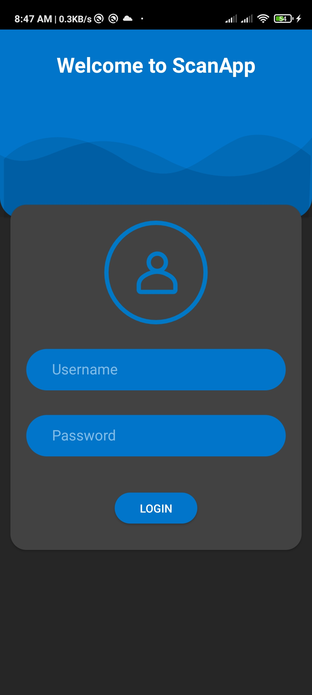
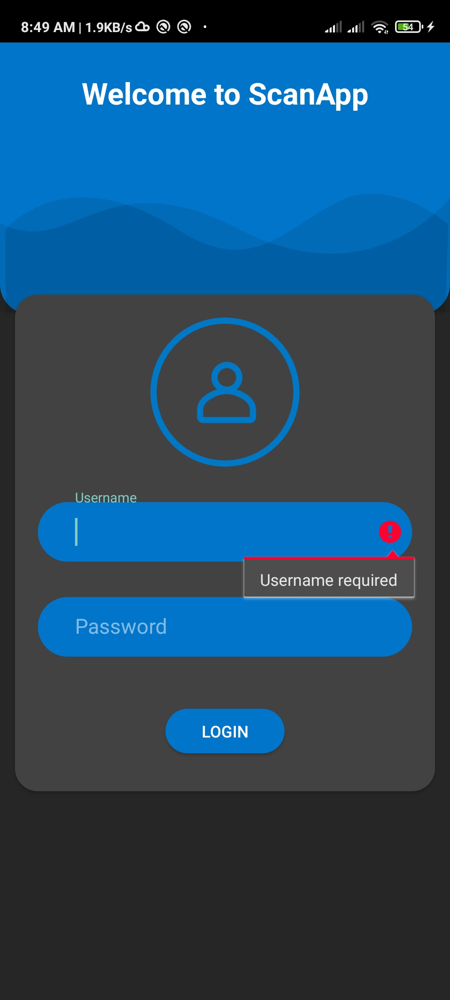
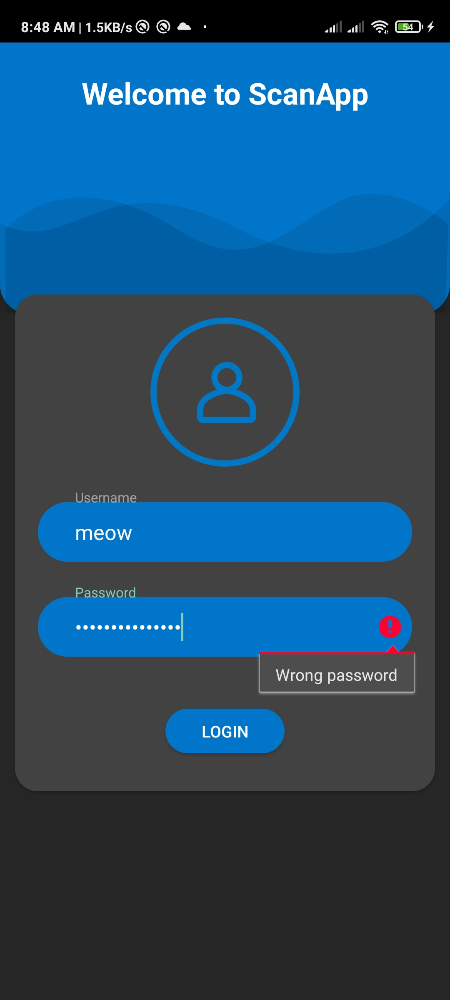
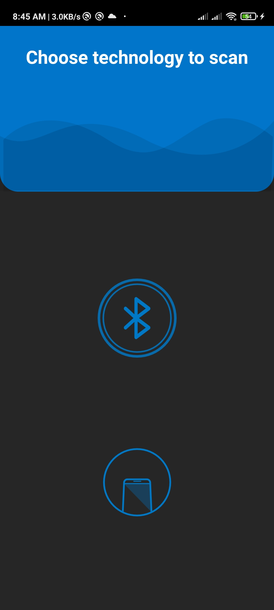
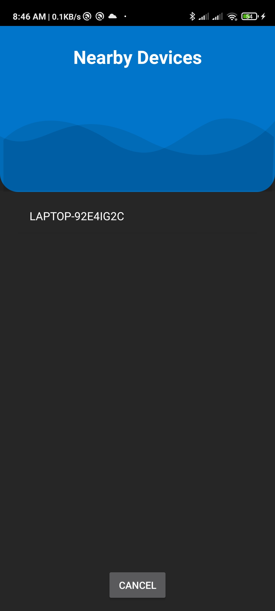
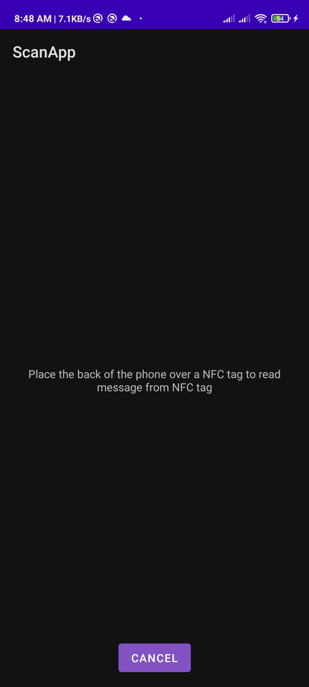
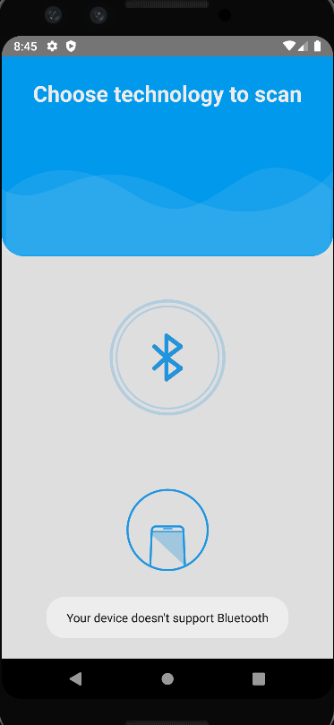

# Carbon

 </em>
 
<em>Technical assessment for Alahram Security Group mobile summer internship. </em>

 

## Contributors

- [@RedBiscuits](https://github.com/RedBiscuits)

## Features

- Login with validation and verification.
- Register new users.
- Scan near Bluetooth devices.
- Read and write NFC tags.
- Animations.
- Scalable to all screen sizes.
- Single hold activity.

# In App Screenshots
## Login

<!--  -->

## Login Validation and Verification

<!--  -->

<!--  -->

## Scan Type

<!--  -->

## Bluetooth

<!--  -->

## NFC

<!--  -->

## Not Supported Devices

<!--  -->

# Technologies
## Android
- Supports Android 6 and above.
- Google material 3 design.
- Data binding
- Kotlin coroutines
- RoomDB
- Single activity hold
- Fragments
- OOD (Singleton and SOLID)
- MVC Architecture
- OOP
- Clean code

## Dependencies
- Card view and design.
- intuint SDP and SSP.
- Lottie animations.
- Coroutines.
- RoomDB.

